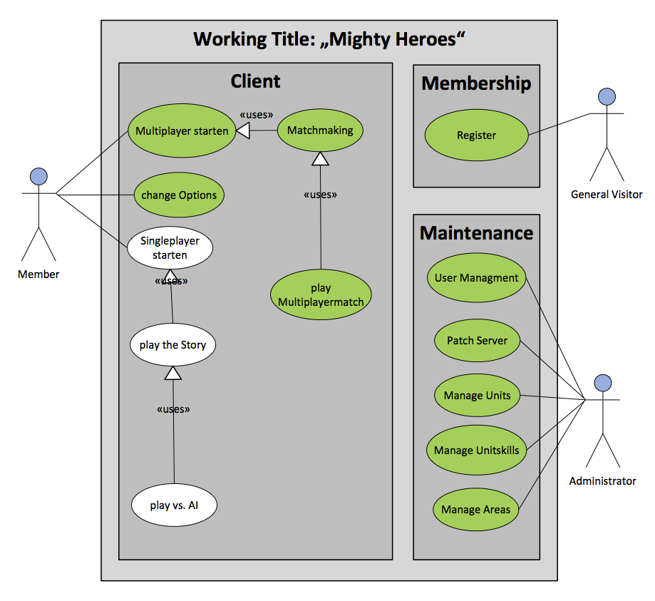

# Working Title: "Mighty Heroes"
#Software Requirements Specification

## Introduction / Einleitung
"Mighty Heroes" soll ein rundenbasiertes Abenteuerspiel werden. Das Spiel wird einen Single- und einen Multiplayermodus enthalten. Im Singleplayer durchwandert der Spieler zusammen mit seinem Held eine Welt mit verschiedenen Zivilisationen. Der Multiplayermodus wird gegen echte Menschen gespielt.

*The game "Mighty Heroes" will be a turn-based adventure game. It will contain a single- and a multiplayer mode. In singleplayer mode, the user and his hero wander through a world with several different civilizations. In multiplayer mode he will fight against real humans.*

### Purpose / Zweck
Ziel ist die Verbesserung unserer Fähigkeiten in Java-Programmierung und Grafik-Design.

*Our Goal is to improve our Java programming and Graphic design skills*

### Scope / Umfang
Siehe farbcodiertes UCD-Diagramm (Grün)

*Visible in the Color coded UCD diagram (Green)*

### Overview / Übersicht
Der folgende Teil enthält eine kurze Übersicht unseres Projekts.

*The following will contain a brief overview of our project.*

## Overall Description / Allgemeine Beschreibung
Die Kämpfe sollen rundenbasiert ablaufen. Der Abenteuermodus wird in Echtzeit vonstattengehen. Der Multiplayermodus wird auf einem zentralen Server realisiert. Dazu werden unter anderem Administration, Serververwaltung, Datenbanken und Logins benötigt.

Bisher ist es geplant, dass zwei Spieler gegeneinander antreten können sollen. Der Spieler betrachtet das Spiel durch eine isometrische Ansicht. Die Kämpfe werden auf einer zufallsgenerierten, begrenzten Karte stattfinden. Jeder Spieler befehligt ein Team von fünf Einheiten. Diese sollen verschiedene Größen, Eigenschaften und Fähigkeiten haben. Die Einheiten bekommen verschiedene Fähigkeiten, welche ab bestimmten Leveln freigeschaltet werden. Diese werden durch Gegenstände nutzbar gemacht. Einmal angelegte Gegenstände können nicht mehr entfernt, aber durch andere Gegenstände ersetzt werden.

*The fights will be turn-based. The andventure mode will be in real-time. Multiplayer will be realized on a central server. To realize our vision we need administration, server and database management as well as user login management.

For now it is planned that two players can fight against each other. The player has an isometric view on the map. The fights will take place on a randomly-generated confined map. Each player's team will contain five units. Those will have different sizes, properties and skills. The units have different skills, which are unlocked at certain levels. They are usable through items. Once equipped, items cannot be removed but only replaced by other items.*

## Specific Requirements / Spezifische Anforderungen
Blender, GIMP, Eclipse, GitHub, MySQL, GNU/Linux, Windows

### User interfaces / Benutzerschnittstellen
Für die verschiedenen Menüs müssen benutzerfreundliche und intuitive Benutzeroberflächen erstellt werden. Diese Benutzeroberflächen dürfen die Sicht auf das Spielfeld nicht unnötig stark beeinträchtigen.

*Several user friendly and intuitive user interfaces have to be created. These user interfaces shouldn't affect the view on the playing field.*

### Graphic Design / Grafikdesign
Wir haben uns auf einen Comic-Stil für das Spiel geeinigt (bekannte Spiele: World of Warcraft, League of Legends, Bioshock Infinite, Braid). Wir wollen insgesamt etwa 50 Einheiten gleichmäßig auf die bisher geplanten fünf Zivilisationen verteilen.
	
*We agreed on using a comic graphic style for the game (famous games: World of Warcraft, League of Legends, Bioshock Infinite, Braid). We plan to include 50 units, distributed evenly on five civilizations.*